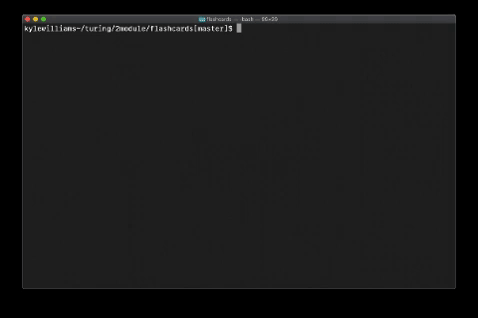

# FlashCards

## Abstract

This application allows the user to go through flashcard questions using the command line. The flashcard data is saved in data.js.

## Setup Instructions

Clone down the files into a directory on your computer. Open terminal and navigate to your flashcard directory. Type `node index.js` to start the game. If you get a score below 90%, the round will automatically restart after 5 seconds.

## Working Application

